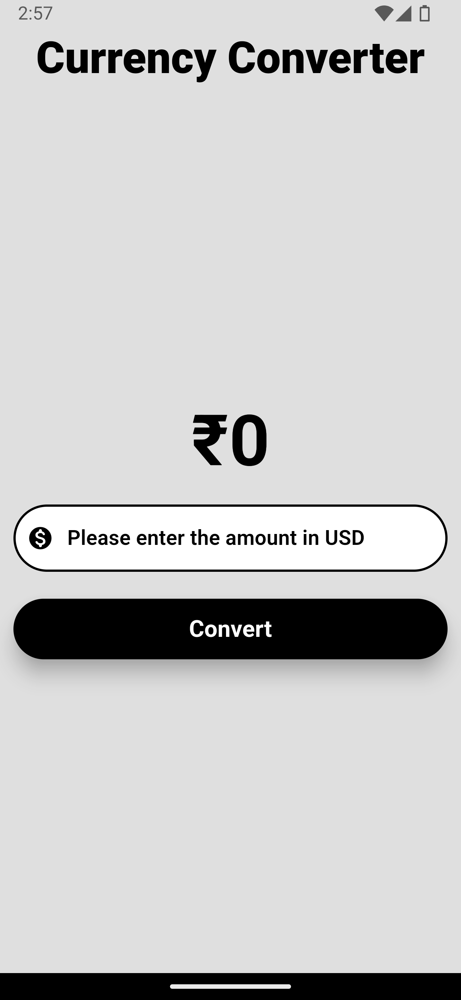
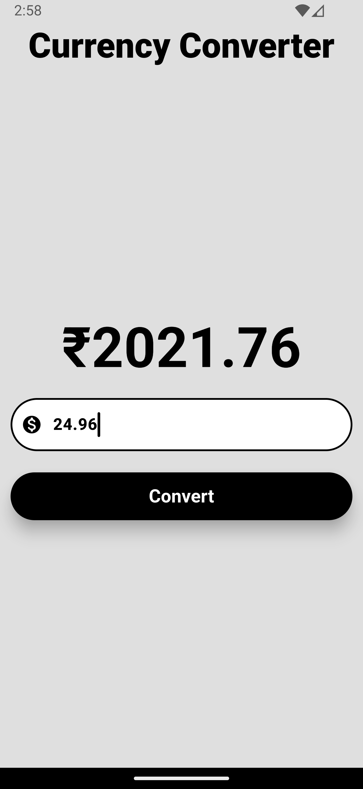

# Currency Converter

A simple Flutter application that converts USD to INR. The application takes an input amount in USD and displays the equivalent amount in INR based on a fixed conversion rate.

## Features

- User-friendly interface with Material Design.
- Real-time conversion from USD to INR.
- Responsive design for various screen sizes.

## Screenshots
<div style="display:flex;align-items:center;justify-content:center;gap:24px;padding:45px;flex-wrap:wrap;">



</div>


## APK Release
You can download the latest Android APK from the [Release](https://github.com/not-adarsh/currency_converter/releases/tag/flutter) section of the repository

## Installation

1. **Clone the repository:**

   ```bash
   git clone https://github.com/your-username/currency-converter.git
   cd currency-converter
   ```

2. **Install the dependencies:**

   ```bash
   flutter pub get
   ```

3. **Run the application:**

   ```bash
   flutter run
   ```

## Usage

1. Open the application.
2. Enter the amount in USD in the provided text field.
3. Press the "Convert" button to see the equivalent amount in INR.

## Code Explanation

The application consists of a single page implemented using Flutter's `StatefulWidget`. The main components are:

- **TextField:** For user input of the amount in USD.
- **ElevatedButton:** To trigger the conversion.
- **Text:** To display the converted amount in INR.

The conversion logic is implemented in the `onPressed` callback of the `ElevatedButton`, which updates the state with the converted amount.


## Acknowledgments

- Inspired from the Flutter Tutorials of ***Rivaan Ranawat***.
- I am following through his Udemy Course which is archieved now but I still have the access.
- [Rivaan's Video on Dart & Flutter in 20 Hours](https://youtu.be/CzRQ9mnmh44?si=UXxG6g71hij387W0)

